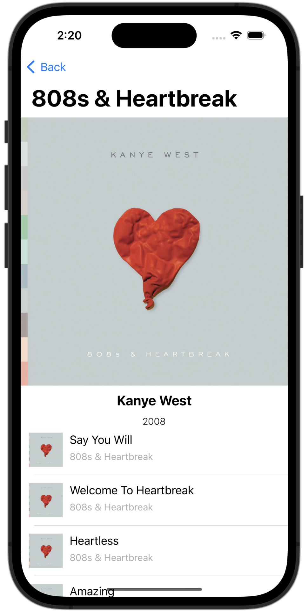

# Melotunes

## Overview

<p float="left">
    
    
    
    
</p>

**Melotunes** is a music player app that simplifies the enjoyment of music from the Deezer top charts:

- **Discover Top Artists**: Explore a curated list of artists featured in the top charts.

- **Artist Profiles**: Select an artist to view their photo, data and track list.

- **Album View**: Explore complete albums, view artwork, and access track listings by selecting an album's name in the player view.

- **Music Player**: Choose a track to launch the player and start listening.
  - Rewind/Fast forward using gestures
  - Different playback modes (shuffle, repeat)

Melotunes focuses on providing a seamless experience for music enthusiasts, allowing you to quickly access and enjoy the latest hits from the top charts with ease.

## Getting started 

1. Clone this repository:
```bash
git clone https://github.com/VladislavFitz/Melotunes
```
2. Launch the Xcode project file:
```
open -a Xcode Melotunes.xcodeproj
```
3. Build and run the app using Xcode.
